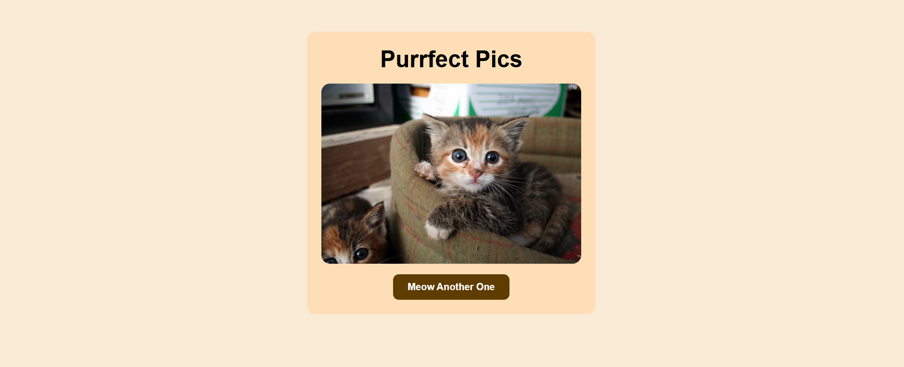

# 🐱 Furry Cats - Random Cat Image Generator

A cute and simple web app that shows a random cat image every time you click the button. Built using **HTML**, **CSS**, and **JavaScript**, and powered by [TheCatAPI](https://thecatapi.com/).

# 💡 Features
- Fetches random cat images using an API
- Fun and clean UI
- Responsive design
- Built with beginner-friendly code

# 🛠️ Technologies Used
- HTML
- CSS (Google Font: Fredoka)
- JavaScript (Async/Await, Fetch API)
- [TheCatAPI](https://thecatapi.com/)

# 📸 Preview

